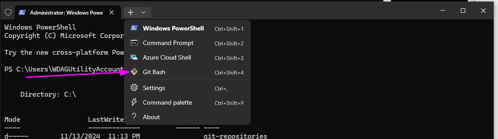
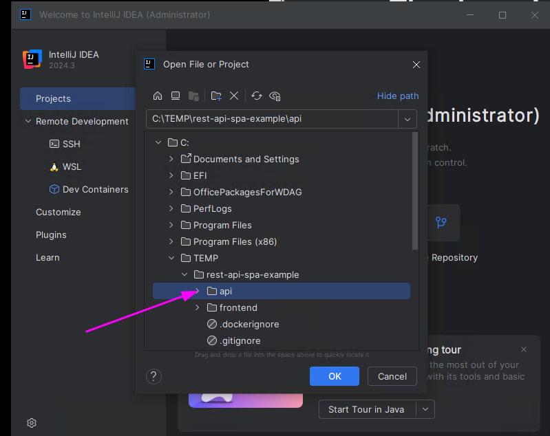
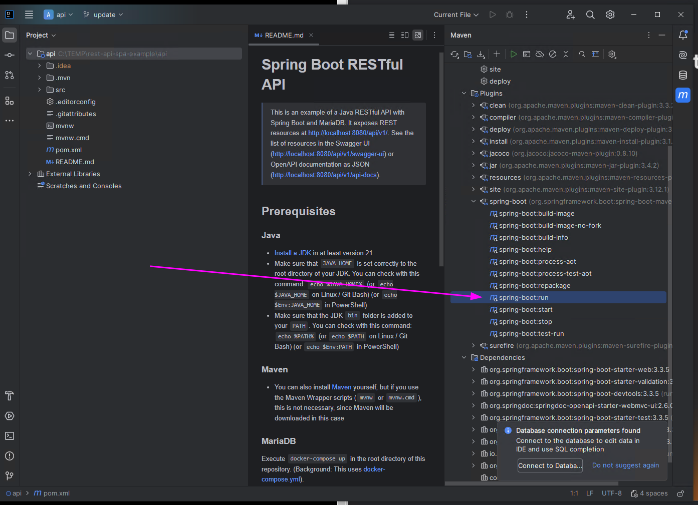
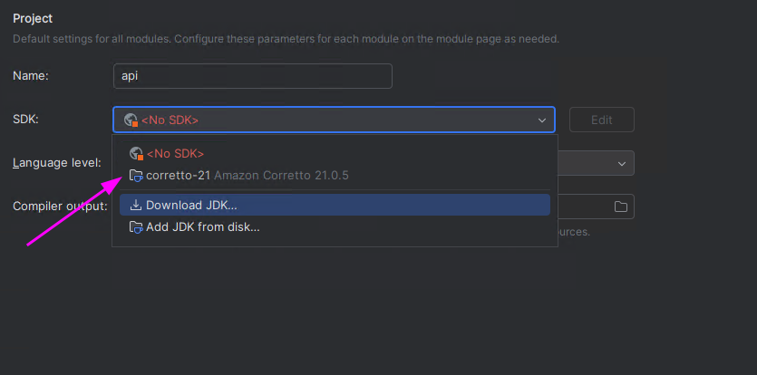
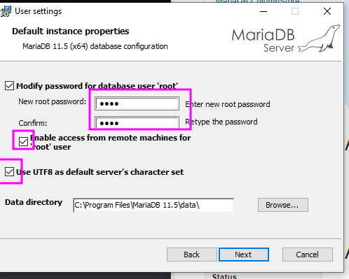

# REST API and SPA Example Project

> This repository contains an example of a web application based on a RESTful API with Spring Boot (`api/`) and a single page application with Vue.js (`frontend/`).
> Please refer to the `README.md` files in the respective folders for concrete instructions.

## Prerequisites

Note: This tutorial is written to avoid installing JDK on your operating system.
IntelliJ supports downloading by itself.
Now, you need to use the Maven menu of IntelliJ.
You will see it below.

### General

1. Ensure that "Windows Terminal" is running (necessary on Windows 10)
2. Clone this repository.

   - Open Windows Terminal
   - Create directory `c:\git-repositories` to collect your git checkouts: `mkdir c:\git-repositories`
   - Open git bash\
     
   - In git bash: `cd /c/git-repositories`
   - `git clone https://github.tik.uni-stuttgart.de/ISTE-ESE/rest-api-spa-example.git`

3. Install Visual Studio Code.

   - Enable 'Add "Open with Code" action to Windows Explorer file context menu'

4. Install [git](https://git-scm.com/downloads/win).

   - Enable "(NEW!) Add a Git Bash Profile to Windows Terminal".
   - Choose "Use Visual Studio Code as Git's default editor".
   - "Override the default branch name for new repositories" to "main"
   - Choose "Use Git and optional Unix tools from the Command Prompt"
   - Choose "Use external OpenSSH"
   - Keep "Use the OpenSSL library"
   - Choose "Checkout as-is, commit Unix-style line endings"
   - Keep everything else

5. Install [JetBrains Toolbox App](https://www.jetbrains.com/toolbox-app/)
6. Install "IntelliJ Ultimate" using the toolbox app.
7. Install [docker](https://www.docker.com/products/docker-desktop/)

### Maven

It is not needed to install [Maven](https://maven.apache.org/) - the scripts (`mvnw` or `mvnw.cmd`) automatically download it.

## Open in IDE

### API

⚠️ DO NOT open this folder in IntelliJ. Open the sub folder! ⚠️

1. 
2. "Trust Project"
3. Close "Install AI Assistant" (by clicking the symbol on the right)
4. "Low memory" warning will pop up. Choose "Configure" and set the "Maximum Heap Size" to 2000. Click "Save and Restart".
5. Add a Java JDK by: Project -> right click -> Module Settings -> SDKs -> "+" -_> "Download SDK" -> Version "21" -> Download -> wait -> "OK"
6. Run `spring-boot:run`\
  
7. A warning will appear
8. Choose the downloaded JDK\
   
9. Set language level to 21.
10. "OK"
11. In the "Run" window, there will be an error - because MariaDB is not started (yet).

## Running

### MariaDB

1. Open Windows Terminal, PowerShell.
2. Change directory: `cd C:\git-repositories\pe2-lecture-code-examples`
3. Execute `docker compose up` (Background: This uses [docker-compose.yml](docker-compose.yml)).

MariaDB stores its data in the subdirectory `maridadb-data`.

Alternative (not recommended): Install and start a local [MariaDB server](https://mariadb.org/download/).
If necessary, update the [API configuration file](src/main/resources/application.properties) with your database port (default is `3306`) and credentials (default is `root`:`root`).

### API

IDE: Execute maven task `spring-boot:run` (available in rest-api -> Plugins -> spring-boot)

### Front end

- `npm install`
- `npm run dev`

## Usage

Assuming all prerequisites are fulfilled, you can follow these instructions to get to know the application:

### Testing the backend

- Open <http://localhost:8080/swagger-ui> in your browser. You can interact with all endpoints using SwaggerUI.
- Open <http://localhost:8080/api/v1/cats> in your browser. It will show all available cats in the system.
- Open <http://localhost:8080/api/v1/cats/1> in your browser. It will show the cat with ID `1`.
- Open <http://localhost:8080/api/v1/cats/42> in your browser. It will show a `404 Not found` error because there is no cat with ID `42` in the system.

### Testing the frontend

- It will host the UI at <http://localhost:5173>, which you can now also open in your browser.
- Navigate to the cats view by clicking on the respective menu item or via the direct ULR <http://localhost:5173/#/cats>.
- Delete a cat. Then confirm its deletion via the API by opening <http://localhost:8080/api/v1/cats> in your browser again.

## Shut down

### MariaDB

To shut down MariaDB, execute `docker compose down`.

### API

- IDE: Click on the stop button
- Command line: Press <kbd>Ctrl</kbd>+<kbd>C</kbd>

## More information

If you choose to install MariaDB using the installer, you need to ensure that `root` is the passwort for `root`. Otherwise, the example won't work.
Moreover, more connections will need to be enabled (probably):

<!-- markdownlint-disable-file MD024 MD033 MD045 -->
